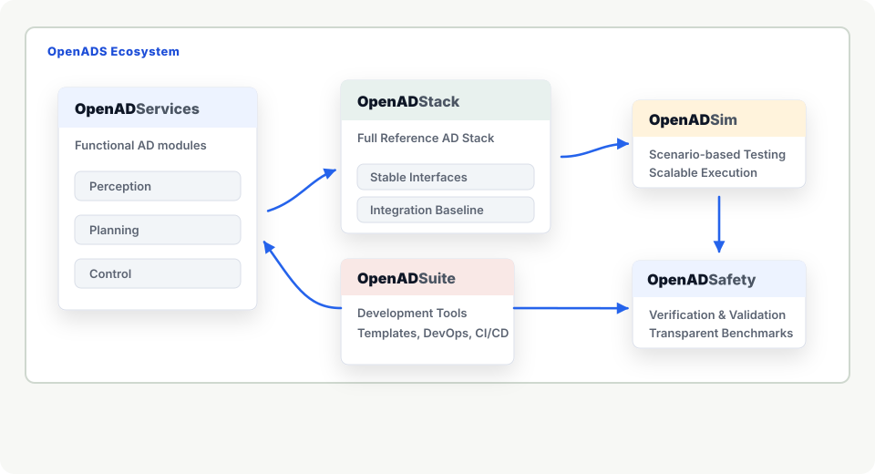

# OpenADS – Open Automated Driving Systems

> [!WARNING]
> 🚧 This organization is currently under construction.

### Collaborative development of Automated Driving Systems

OpenADS explores how distributed partners can build compatible automated driving services and use benchmarks to identify stronger system compositions. The work is embedded in Germany's [Ecosystem Mobility 4.0](https://ecosystemmobility40.de/en/home/) initiative and aligned with the goals of the [European Connected and Autonomous Vehicle Alliance](https://digital-strategy.ec.europa.eu/en/policies/vehicle-alliance).

> [!TIP]
> Have a look at the [**OpenADS Documentation**](https://openads-project.github.io) for a quick introduction!

## The OpenADS Ecosystem

| Repository | Description | Release | Documentation |
| ---------- | ----------- | ------- | ------------- |
| [**OpenADS**](https://github.com/openads-project) | Documentation and tutorials for collaborative development in the Open Automated Driving Systems project. | ✅ |  |
| [OpenADStack](https://github.com/openads-project/openadstack) | Baseline reference implementation for modular ROS 2 automated-driving stacks in OpenADS. |  |  |
| [OpenADServices](https://github.com/search?q=topic%3Aopenadservice&type=repositories) | Federated modular building blocks that can be used with the OpenADStack. | ✅ |  |
| [OpenADSim 🚧](https://github.com/openads-project/openadsim) | Simulation environment for testing the OpenADStack with CARLA or SUMO. |  |  |
| [OpenADSuite](https://github.com/search?q=topic%3Aopenadsuite&type=repositories) | Development tools that streamline developer workflows, such as module templates and ready-to-use development environments. | ✅ |  |
| [OpenADSafety 🚧](https://github.com/search?q=topic%3Aopenadsafety&type=repositories) | Documentation and tools for validation and verification of automated-driving modules and full stacks. | ✅ |  |

## Get Involved

Have a look at our current [**backlog**](https://github.com/orgs/openads-project/projects/4/views/1) and [**roadmap**](https://github.com/orgs/openads-project/projects/4/views/4) to see what's currently being discussed and is up for discussion next. You are welcome to join the discussions and get in touch as described in the [**Support**](http://openads-project.github.io/support/support.html) page.

## Events

| Date | Place | Event |
| ---- | ----- | ----- |
| 15 September 2026 | Naples, Italy | [OpenADS Tutorial](https://openads-project.github.io/tutorial-itsc-26/) at the [IEEE International Conference on Intelligent Transportation Systems (ITSC)](https://ieee-itsc.org/2026/) |
