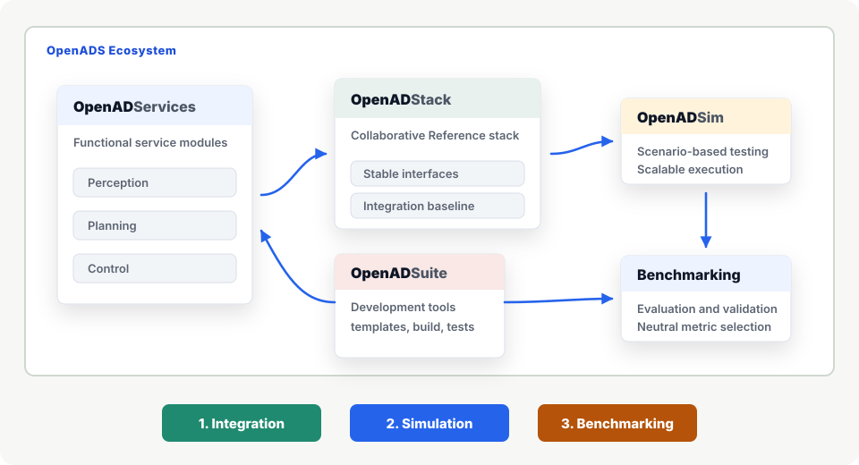

# OpenADS - Open Automated Driving Systems

> 🚧 Warning: This project is currently under construction.

  
  
  
  
  

### Collaborative development and benchmark-driven evaluation

OpenADS explores how distributed partners can build compatible automated driving services and use benchmarks to identify stronger system compositions. The work is embedded in Germany's [Ecosystem Mobility 4.0](https://ecosystemmobility40.de/en/home/) initiative and aligned with the goals of the [European Connected and Autonomous Vehicle Alliance](https://digital-strategy.ec.europa.eu/en/policies/vehicle-alliance).

## Repositories

> 🔗: Repository is not hosted in the [openads-project](github.com/openads-project/) GitHub organization

### Documentation

| Repository | Description | Status |
| ---------- | ----------- | ------ |
| [openads-project.github.io](https://github.com/openads-project/openads-project.github.io) | [**Documentation of the OpenADS ecosystem**](https://openads-project.github.io), including automated driving software stack, simulation and development toolchain. | 🚧 Under Construction |
| [tutorial-itsc-26](https://github.com/openads-project/tutorial-itsc-26) | [Website](https://openads-project.github.io/tutorial-itsc-26/) for OpenADS tutorial on IEEE ITSC 2026 in Naples, Italy. | ✅ Active |

### OpenADSuite - The Development Suite

| Repository | Description | Status |
| ---------- | ----------- | ------ |
| [rviz-monitoring]() | Monitoring and visualization using [RViz](https://github.com/ros2/rviz) with support for message definitions used in OpenADS. | 🚧 Under Construction |
| [lichtblick-monitoring]() | Monitoring and visualization using [Lichtblick](https://github.com/lichtblick-suite/lichtblick) with support for message definitions used in OpenADS. | 📋 Planned |
| [openads_demo_module](https://github.com/openads-project/openads_demo_module) | Template for new OpenADS modules including OpenADSuite development environment and CI/CD workflows | ✅ Active |
| [openads-dev-environment](https://github.com/openads-project/openads-dev-environment) | Common development environment for OpenADS modules | ✅ Active |
| [docker-ros](https://github.com/ika-rwth-aachen/docker-ros) 🔗 | docker-ros automatically builds development and deployment Docker images for your ROS-based repositories. | ✅ Active |
| [docker-ros-ml-images](https://github.com/ika-rwth-aachen/docker-ros-ml-images) 🔗 | Machine Learning-Enabled ROS Docker Images. | ✅ Active |
| [ros2-pkg-create](https://github.com/ika-rwth-aachen/ros2-pkg-create) 🔗 | Powerful ROS 2 Package Generator. | ✅ Active |
| [perception_interfaces](https://github.com/ika-rwth-aachen/perception_interfaces) 🔗 | ROS packages with common messages and tools relating to the perception task in automated driving and C-ITS. | ✅ Active |
| [planning_interfaces](https://github.com/ika-rwth-aachen/planning_interfaces) 🔗 | ROS packages with common messages and tools relating to the behavior planning task of automated vehicles. | ✅ Active |
| [etsi_its_messages](https://github.com/ika-rwth-aachen/etsi_its_messages) 🔗 | ROS 2 Support for ETSI ITS Messages for V2X Communication. | ✅ Active |

### OpenADStack - The Automated Driving Stack

| Repository | Description | Status |
| ---------- | ----------- | ------ |
| [openadstack](https://github.com/openads-project/openadstack) | Full stack compositions for different automated driving use cases | 🚧 Under Construction |

### OpenADServices - Modular Functional Building Blocks for Full-Stack Compositions

#### Perception

| Repository | Description | Status |
| ---------- | ----------- | ------ |
| [point_cloud_fusion]() | GPU-accelerated (early) fusion of point clouds from multiple (lidar) sensors. | 📋 Planned |
| [point_cloud_object_detection]() | ML-based 3D object detection in lidar point clouds, which is trained, e.g., on the DrivIng dataset. | 📋 Planned |
| [point_cloud_object_clustring]() | clusters object points (e.g. vehicles/pedestrians) for visualization in HMI. | 📋 Planned |
| [autoware_ground_segmentation_cuda]() | GPU-accelerated whitebox (non-AI) ground filter for lidar point clouds, could be part of a (non-AI) safety layer. | 📋 Planned |
| [autoware_probabilistic_occupancy_grid_map]() | GPU-accelerated whitebox (non-AI) occupancy grid mapping from lidar point clouds, could be part of a (non-AI) safety layer. | 📋 Planned |
| [traffic_light_detection]() | Detector for location and state of traffic lights using YOLOv5. | 📋 Planned |

#### Understanding

| Repository | Description | Status |
| ---------- | ----------- | ------ |
| [object_fusion]() | (Late) fusion of 3D object lists. | 📋 Planned |
| [lanelet2_object_list_prediction]() | Dynamic object prediction based on Lanelet2 map information and kinematic models. | 📋 Planned |

#### Planning

| Repository | Description | Status |
| ---------- | ----------- | ------ |
| [ego_state_estimation]() | Dynamics state estimation for ego vehicle based on GNSS and IMU data. | 📋 Planned |
| [lanelet2_map_server](https://github.com/openads-project/lanelet2_map_server) | ROS 2 HD Map Server for Automated Driving based on Lanelet2. | 🚧 Under Construction |
| [lanelet2_route_planning](https://github.com/openads-project/lanelet2_route_planning) | ROS 2 Route Planning for Automated Driving based on Lanelet2. | 🚧 Under Construction |
| [dynamic_map_enrichment]() | Enriches route information with regulatory elements (e.g. traffic light states). | 📋 Planned |
| [simple_planner]() | Plans a reference trajectory based on route and Lanelet2 map. | 🚧 Under Construction |
| [planning_orchestrator]() | Switches between different planning modules, e.g. rule-based vs. AI planner. | 📋 Planned |
| [trajectory_optimization](https://github.com/openads-project/trajectory_optimization) | ROS 2 Trajectory Optimization for Automated Driving based on an Optimal Control Problem (OCP). | ✅ Active |
| [ackermann_trajectory_control](https://github.com/openads-project/ackermann_trajectory_control) | Cascaded ROS 2 PID Controller for Ackermann steered vehicles. | 🚧 Under Construction |

### OpenADSim - The Simulation Environment

| Repository | Description | Status |
| ---------- | ----------- | ------ |
| [openadsim]() | Simulation environment for running and testing OpenADStack with CARLA or SUMO. | 🚧 Under Construction |
| [carla-simulator]() | High-fidelity rendering and physics backend based on CARLA for closed-loop sensor and vehicle simulation. | 🚧 Under Construction |
| [carla-ros-bridge]() | ROS 2 connection to CARLA topics, services, exposing simulator state and controls to the OpenADS ecosystem. | 🚧 Under Construction |
| [carla-scenario-runner]() | Execution of OpenSCENARIO scenarios in CARLA for repeatable scenario-based simulation and testing. | 🚧 Under Construction |
| [ros_middleware_bridge]() | DDS-to-Zenoh bridge that connects CARLA native ROS communication with the OpenADStack middleware. | 🚧 Under Construction |
| [carla_converter]() | Conversion of CARLA-specific simulation outputs into OpenADS-compatible ego, object, map, and V2X topics. | 🚧 Under Construction |
| [sumo_converter]() | Conversion of SUMO traffic simulation data into OpenADS-compatible ego, object, and map topics. | 🚧 Under Construction |
| [simulation_adapter]() | Backend-independent adapter that normalizes simulator outputs and connects OpenADStack. | 🚧 Under Construction |

## Contribution

We are currently in the community building process and will establish a governance model and working groups to coordinate collaboration in this project. Meanwhile, we welcome contributions via issues or pull requests in the repositories.
